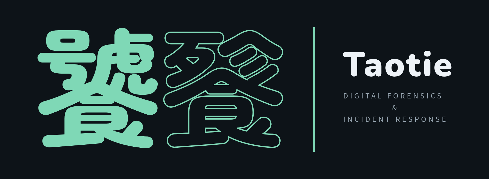
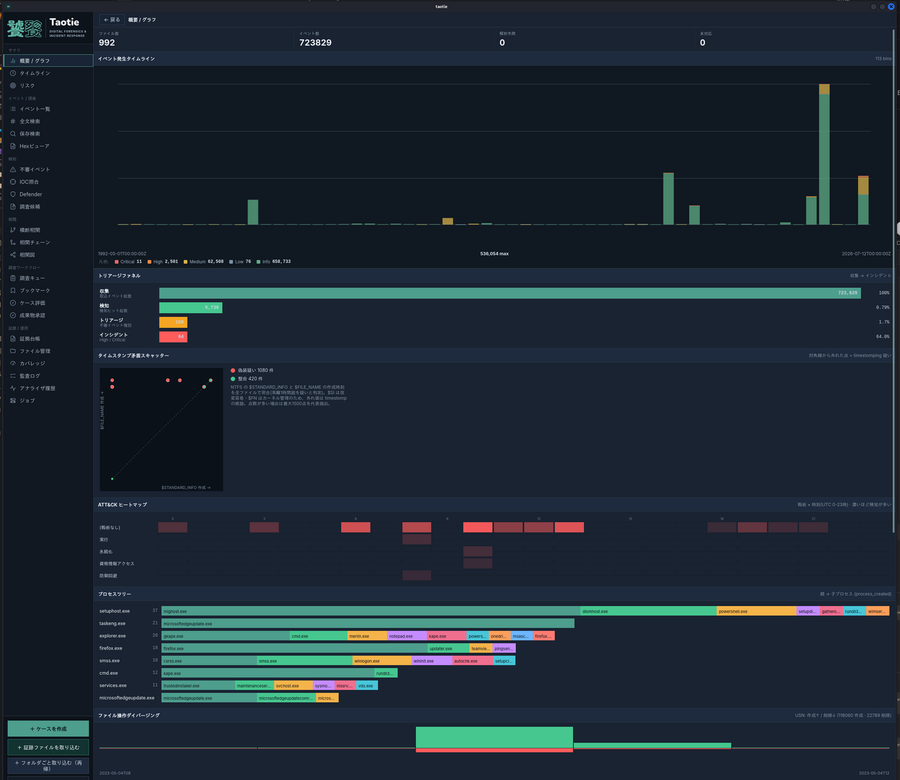
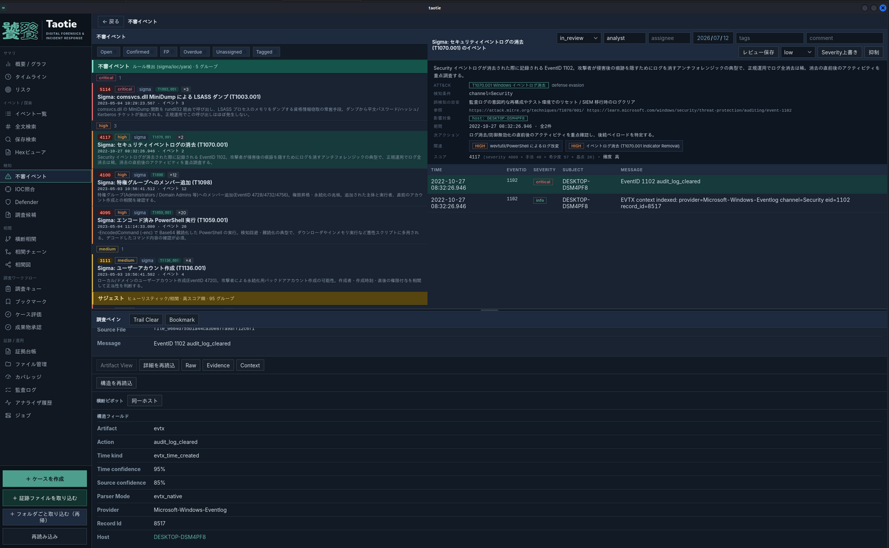
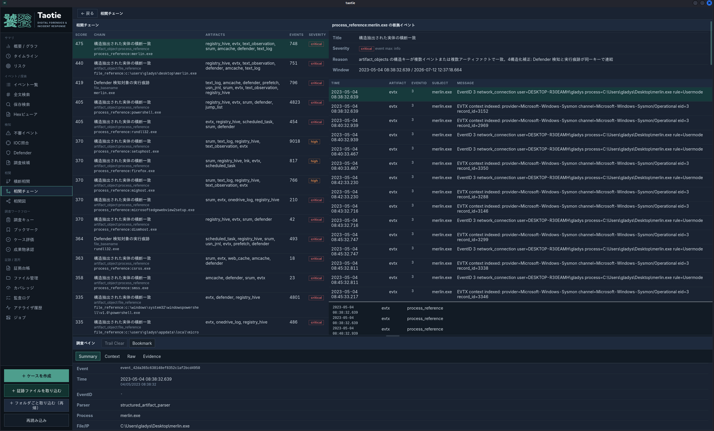
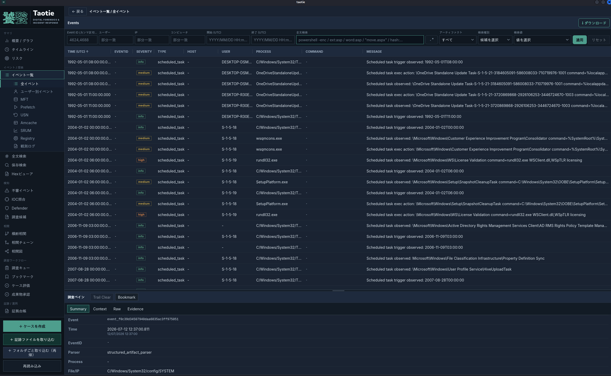
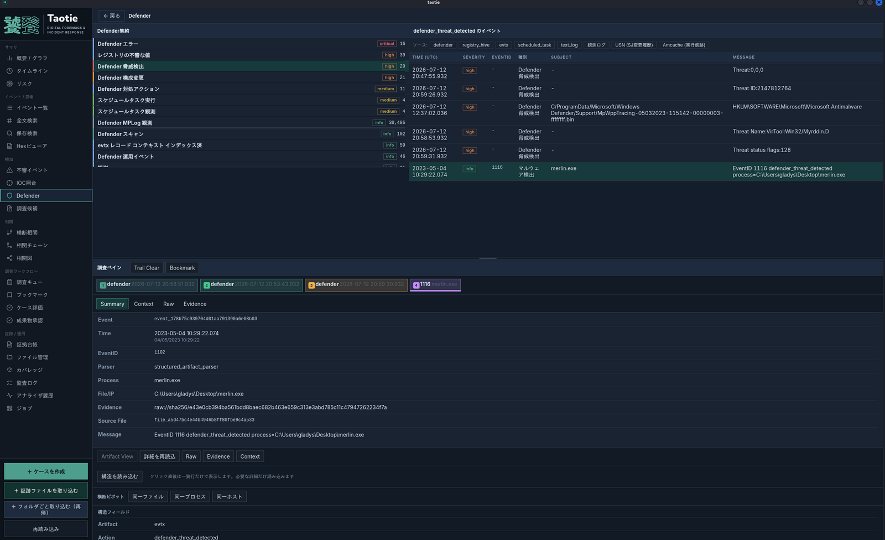

<p align="center">
  
</p>

<p align="center">
  Local-first DFIR timeline &amp; detection workbench for Windows forensic artifacts —
  offline, on your machine. Built with Tauri v2 + Svelte 5 + Rust.
</p>

<p align="center">
  
  <a href="https://github.com/morimori-dev/taotie/actions/workflows/release.yml"></a>
</p>

Taotie takes a triage collection, ingests it into a local DuckDB data lake, and
turns it into one unified timeline with sigma + heuristic detection, cross-artifact
correlation, and analysis charts. Everything runs on your machine — no case data
leaves the host.

<p align="center">
  
</p>

---

## Why Taotie

- **Local-first & offline.** A single desktop app. Evidence is parsed into a local
  lake; nothing is uploaded. Good for air-gapped or sensitive engagements.
- **One timeline across 19 artifact types.** EVTX, `$MFT`, USN journal, Prefetch,
  Amcache, Registry, SRUM, Defender and more, merged and time-normalized.
- **Reads raw artifacts *and* tool exports.** Native binaries (`$MFT`, `$J`,
  `.evtx`, `.pf`, `Amcache.hve`, registry hives …) as well as CSV/JSON exports from
  KAPE, MFTECmd, PECmd, hayabusa, etc. — classified by name, extension, or content.
- **Multi-engine detection, not single-shot.** sigma rules + a native heuristic
  library + IOC/YARA, layered with **cross-artifact correlation chains** so a lone
  event becomes a story (`download → execute → persist`).
- **Findings you can act on.** Every detection carries ATT&CK technique/tactic
  mapping, a Japanese explanation, affected host/user/process entities, a score
  rationale, and suggested next actions.
- **Fast on large cases.** A columnar DuckDB/Parquet lake keeps hundreds of
  thousands to millions of events responsive.
- **AI-optional by design.** No AI is built in — every detection is
  deterministic and reproducible, so findings hold up in a report. When you
  *do* want a model, Taotie ships a read-only [MCP server](#ask-your-own-ai-mcp)
  so you can point Claude (or any MCP client) at a case while the evidence
  stays on your host.

## How it compares

- **hayabusa** — Taotie ingests its output directly and adds the other artifact
  types, correlation, and an investigation UI. Complementary, not competing.
- **Timesketch** — server-based and collaborative; Taotie is a single local
  desktop app. No server, nothing uploaded.
- **EZ Tools + Timeline Explorer** — Taotie reads EZ Tools CSVs and adds
  built-in detection, correlation chains, and chart-to-event pivoting.

## Screenshots

> Screenshots use HackTheBox's retired [_TickTock_](https://app.hackthebox.com/sherlocks/TickTock) Sherlock as sample data.

**Suspicious events**

<p align="center">
  
</p>

**Correlation chains**

<p align="center">
  
</p>

**Event explorer**

<p align="center">
  
</p>

**Defender**

<p align="center">
  
</p>

## Features

- **Ingest** a triage collection (folder or files) into a Parquet/DuckDB lake
  with automatic artifact-type detection.
- **Timeline** with severity-stacked bins and click-to-drill into the events.
- **Event explorer** — paged, sortable grid with a search DSL, per-event detail,
  and server-side CSV/JSONL export of the full filtered set.
- **IOC matching** — sweep the whole lake for IP / URL / hash / path / name
  indicators.
- **Answer candidates** — auto-extracted candidates for the questions every
  investigation asks (initial access, execution, persistence, exfil, …).
- **Triage workflow** — triage queue, bookmarks, saved searches, per-finding
  review states.
- Plus a **hex viewer**, **Defender view**, and **risk view** (ATT&CK techniques
  by severity).

Detection, correlation, and charts have their own sections below.

## Search DSL

The event explorer and full-text search share one query language. Terms
combine with AND; quote values that contain spaces.

```text
finding:true severity:high channel:Security eid:4624 after:2023-05-01T00:00 path:"C:\Users"
```

| Filter | Meaning |
| --- | --- |
| `after:` / `before:` | time window, UTC (`since:`/`until:` also work) |
| `host:` `user:` `process:` `path:` | entity and file-path filters |
| `ip:` `url:` `hash:` | indicators |
| `eid:` `channel:` `level:` `action:` `type:` | event log fields, normalized action, artifact type |
| `severity:` / `finding:true` | detection severity / only events with detections |
| free text | full-text match across message and fields |

## Ask your own AI (MCP)

Taotie has no built-in AI — detection is deterministic and every finding is
explainable. But it ships `taotie-mcp`, a **read-only [Model Context
Protocol](https://modelcontextprotocol.io) server** so you can bring your own
model and interrogate a case in natural language. It speaks JSON-RPC over
stdio, opens the case read-only (evidence integrity is untouched), and exposes
six tools:

`case_summary` · `search_events` (the full search DSL) · `get_event_detail` ·
`list_findings` · `get_timeline` · `get_correlation_chains`

Because it's local stdio and read-only, **the case never leaves your host** —
the model client runs on the same machine and only sees what it asks for.

Register it with Claude Code:

```sh
claude mcp add taotie -- /path/to/taotie-mcp --case-root /path/to/your/case
```

Or with Claude Desktop / any MCP client (`claude_desktop_config.json`):

```json
{
  "mcpServers": {
    "taotie": {
      "command": "/path/to/taotie-mcp",
      "args": ["--case-root", "/path/to/your/case"]
    }
  }
}
```

Then ask things like *"what are the critical findings?"*, *"search for encoded
PowerShell after 2023-05-01"*, or *"walk the correlation chains involving
setuphost.exe"*. The `taotie-mcp` binary is attached to each
[release](https://github.com/morimori-dev/taotie/releases) (and bundled inside
the Windows portable zip).

## UI languages

Language and font size are switched from the **Settings** tab. Japanese
(default) and English are complete; 中文 / हिन्दी / Français / Deutsch currently
cover navigation and settings, falling back to Japanese elsewhere. Bundled
detection descriptions are Japanese for now.

## Supported artifacts & inputs

Taotie classifies each file by name, extension, or content, so it accepts both
raw Windows artifacts and CSV/JSON exports from common triage tools.

| Artifact | Typical source files / logs |
| --- | --- |
| Windows Event Logs (`evtx`) | `Security.evtx`, `System.evtx`, `Application.evtx`, Sysmon, PowerShell, TaskScheduler, TerminalServices, … (`.evtx`), plus EVTX CSV/JSON and hayabusa output |
| NTFS MFT (`mft`) | `$MFT` (`.mft`), MFTECmd CSV |
| USN Journal (`usn_jrnl`) | `$Extend\$UsnJrnl:$J`, USN CSV |
| Prefetch (`prefetch`) | `*.pf` (`C:\Windows\Prefetch`), PECmd CSV |
| Amcache (`amcache`) | `Amcache.hve`, Amcache CSV |
| ShimCache (`shimcache`) | AppCompatCache (SYSTEM hive) / CSV |
| Registry hives (`registry_hive`) | `SYSTEM`, `SOFTWARE`, `SAM`, `SECURITY`, `NTUSER.DAT`, `UsrClass.dat` |
| SRUM (`srum`) | `SRUDB.dat` |
| Microsoft Defender (`defender`) | MPLog, Operational log, detection history |
| Shortcuts (`lnk`) | `*.lnk` |
| Jump Lists (`jump_list`) | Automatic/Custom Destinations |
| Browser history (`browser`) | Chrome/Edge/Firefox history (`places.sqlite`, `History`), CSV |
| Web cache (`web_cache`) | `WebCacheV01.dat` |
| OneDrive (`onedrive_log`) | OneDrive sync logs (`*.odl`) |
| Scheduled tasks (`scheduled_task`) | Task definitions |
| Windows Search (`windows_search_log`) | `Windows.edb` |
| ESE databases (`ese`) | generic `.edb` / ESE stores |
| Generic (`csv` / `jsonl` / `text_log`) | `.csv`, `.jsonl`, `.json`, `.txt`, `.log` fall-backs |

## Detection engines

- **sigma** — 24 bundled rules (LSASS dump, event-log clearing, encoded
  PowerShell, LOLBins, certutil/bitsadmin download, Defender tampering, …),
  each with description, references, false-positive notes, and ATT&CK tactics.
- **taotie-core** — a native heuristic library: timestomping (`$SI`/`$FN`
  mismatch), LOLBin/RAT/C2 execution inventories, pass-the-hash, password
  spray, brute-force → success, forged Kerberos tickets, privileged account
  creation, service installs, mass executable deletion, execution-then-delete,
  off-hours logons, RDP sources, updater masquerade, user-writable-path
  execution.
- **ioc / yara** — indicator and signature matching over the lake.

**Bring your own sigma rules.** Point `TAOTIE_SIGMA_RULES` at a directory and
every `.yml`/`.yaml` in it is loaded (recursively) on top of the bundled set.
Modifiers include `contains`/`startswith`/`endswith`/`all`/`re`/`windash`/`cased`;
invalid rules are skipped, not fatal.

```sh
TAOTIE_SIGMA_RULES=/path/to/your/rules ./taotie-app
```

## Correlation

Correlation turns isolated events into attack narratives. Chains are keyed on
shared entities (host / user / process / file / ip / hash) and time windows:
`download → execute`, `file created → executed`, `scheduled task / service /
registry persistence → executed`, `executed → deleted`, `Defender threat →
executed`, plus multi-stage intrusion chains within a time window.

## Evidence integrity

Built for work that may end up in a report — or in court:

- **Evidence ledger** — every ingested file inventoried with size and SHA-256;
  original bytes kept verbatim.
- **Custody manifest** — exportable chain-of-custody manifest, re-verifiable.
- **Signed report bundles** — hashed and signed with a per-workspace key,
  verification built in.
- **Approvals & audit log** — approval states for deliverables, audit trail of
  case operations.

See [docs/security.md](docs/security.md) for the threat model.

## Analysis charts

Triage funnel, `$SI`/`$FN` timestomp scatter (off-diagonal points are
timestomping suspects), ATT&CK tactic × hour heatmap, process tree, USN
file-op diverging bars, and a beaconing interval histogram — every chart
drills down into the event list.

## Architecture

Seven-crate Rust workspace (schema / storage / parsers / api / jobs / search /
[mcp](crates/taotie-mcp)). Raw object store + Parquet read models behind a
**DuckDB** query layer, with a **SQLite** job queue driving ingest. Frontend is
a Tauri v2 shell with a Svelte 5 UI; sigma rules are embedded at build time.
The MCP server reuses the same query layer as the desktop app.

## Download & run

Prebuilt bundles for each tagged version are on the GitHub
[Releases](https://github.com/morimori-dev/taotie/releases) page. No build
environment is required.

**Windows**

- Portable (no installation): download `taotie_<version>_x64-portable.zip`,
  extract, and double-click `taotie.exe`. Requires the WebView2 runtime, which
  is preinstalled on Windows 11 and most Windows 10 systems
  ([download](https://developer.microsoft.com/microsoft-edge/webview2/) if missing).
- Installer: download `taotie_<version>_x64-setup.exe`, run it, and launch
  Taotie from the Start menu. The installer bootstraps WebView2 automatically.

> **Windows security prompts (expected).** The Windows binaries are **not
> code-signed**, so Windows will warn you on first run — this is normal for an
> unsigned app, not a sign of malware:
> - **SmartScreen** shows a blue *"Windows protected your PC — unknown
>   publisher"* dialog. Click **More info → Run anyway**.
> - **Windows Defender / antivirus** may flag or quarantine it as a **false
>   positive**. Taotie is a DFIR tool whose detection engine contains the names
>   and signatures of attacker tools (mimikatz, SharpHound, LOLBins, …) as plain
>   strings, which heuristic AV sometimes reacts to. If it's quarantined, restore
>   it and add an exclusion, or verify the file hash against the release page.
>
> Build from source (below) if you prefer to run a binary you compiled yourself.

**Linux**

1. Download `taotie_<version>_amd64.AppImage`, place it anywhere, and run it:

   ```sh
   chmod +x taotie_<version>_amd64.AppImage
   ./taotie_<version>_amd64.AppImage
   ```

   The AppImage is self-contained (WebKitGTK bundled) — no installation needed.

2. Debian/Ubuntu alternative: `sudo apt install ./taotie_<version>_amd64.deb`

Releases are built by the [release workflow](.github/workflows/release.yml),
triggered by pushing a `v*` tag.

**Troubleshooting**

- *AppImage won't start* — type-2 AppImages need FUSE 2
  (`sudo apt install libfuse2` on Debian/Ubuntu), or run it without FUSE:
  `./taotie_<version>_amd64.AppImage --appimage-extract-and-run`
- *Blank window on Linux* — some GPU/driver combos hit a WebKitGTK rendering
  issue; try `WEBKIT_DISABLE_DMABUF_RENDERER=1 ./taotie_<version>_amd64.AppImage`
- *Portable exe shows a WebView2 error on Windows 10* — install the
  [WebView2 runtime](https://developer.microsoft.com/microsoft-edge/webview2/)
  once, or use the installer, which bootstraps it.
- *"Unknown publisher" / certificate warning, or Defender flags the exe* — the
  binaries are unsigned; SmartScreen and antivirus may warn. See the note under
  **Download & run → Windows** above. This is expected for an unsigned DFIR tool,
  not malware — click **More info → Run anyway**, and restore/exclude it in
  Defender if quarantined.

## Build from source

**Prerequisites**

- Rust (stable) and Node.js 18+.
- Linux: the Tauri v2 system dependencies (WebKitGTK 4.1, etc.) —
  see <https://v2.tauri.app/start/prerequisites/>.

**Build a distributable bundle**

```sh
cd ui
npm install
npm run taotie:build
```

This produces installers/bundles under `src-tauri/target/release/bundle/`
(Linux: AppImage + `.deb`; Windows: `.exe` when built on Windows).

> Building the bare binary with cargo instead? A standalone build needs
> `cargo build --release --features tauri/custom-protocol` — a plain release
> build runs in dev mode and expects the Vite dev server.

## Workflow

1. Create/open a case and point it at a triage collection.
2. Ingest — artifacts are parsed into the lake and read models are built.
3. Review the **overview** and **triage funnel**, then the **suspicious events**.
4. Follow **correlation** chains and pivot from any chart into the event list.
5. Export the filtered events (CSV/JSONL) for the report.

## Development

```sh
cd ui
npm install
npm run taotie:dev       # Tauri dev (webview + Vite dev server at 127.0.0.1:5174)
```

Checks and tests:

```sh
cargo fmt --all
cargo test --workspace
cd ui && npm run check   # svelte-check
```

## More documentation

- [docs/architecture.md](docs/architecture.md) — crate layout and data flow
- [docs/schema.md](docs/schema.md) — normalized event schema
- [docs/security.md](docs/security.md) — evidence handling and threat model
- [docs/adapter_contract.md](docs/adapter_contract.md) — adding parsers/adapters
- [docs/roadmap.md](docs/roadmap.md) — where this is going

## License

Licensed under either of

- Apache License, Version 2.0 ([LICENSE-APACHE](LICENSE-APACHE) or <http://www.apache.org/licenses/LICENSE-2.0>)
- MIT license ([LICENSE-MIT](LICENSE-MIT) or <http://opensource.org/licenses/MIT>)

at your option.

### Contribution

Unless you explicitly state otherwise, any contribution intentionally submitted
for inclusion in the work by you, as defined in the Apache-2.0 license, shall be
dual licensed as above, without any additional terms or conditions.

## Disclaimer

Taotie is a defensive DFIR tool intended for authorized incident response and
forensic analysis of systems you are permitted to examine.
